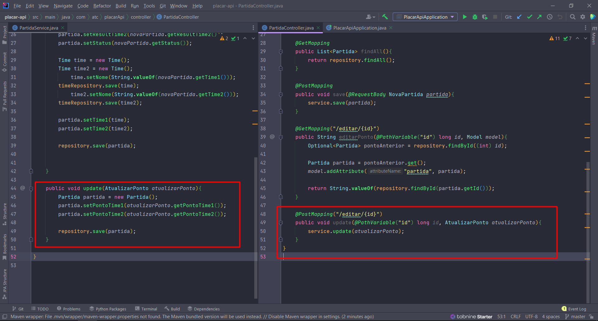

# placar-api

Banco de dados para armazenar times e partidas. 
preciso estar constantemente alterando os pontos dos times que são armazenados e não consigo fazer isso, está foi minha tentativa ,porém, 
sempre salva uma nova partida ao invés de alterar os pontos de uma exitente. 
tentei atualizar os pontos usando um dto, assim como fiz para criar uma nova partida, mas não sei se era o certo a se fazer

